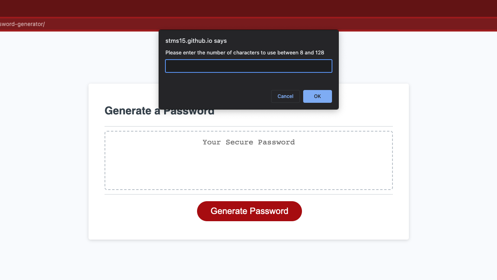
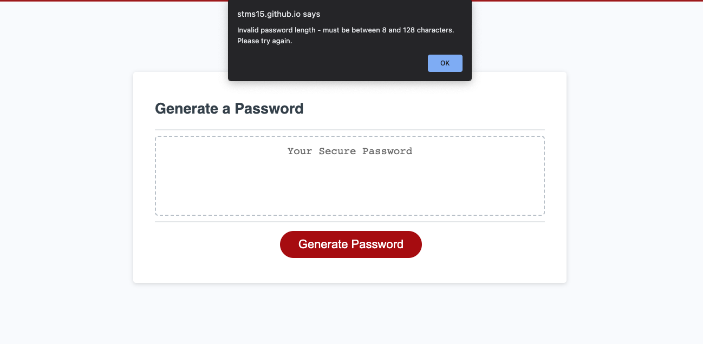
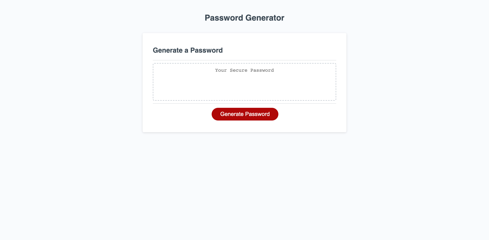

# Random Password Generator

## Description

This project generates a random password based on criteria set by the user. It prompts the user to answer questions about the length and characters to use in the password, and then writes the resulting randomly generated password to the screen.

During the project, I learned more about Javacript prompts, alerts, and the Math library and functions.

## Table of Contents

- [Installation](#installation)
- [Usage](#usage)
- [Credits](#credits)
- [License](#license)

## Installation

N/A

## Usage

The website is hosted on GitHub here: https://stms15.github.io/random-password-generator/ and can be used to generate a random password based on criteria set by the user. 

When the "Generate Password" button is clicked, the user is prompted with a series of questions that must be ansered. These include the length of the password and the types of characters to use (lower case, upper case, numbers, and special characters). The prompts look like the picture below.

For the length of the password, the user must enter a number between 8 and 128. The types of characters will be prompted one by one and the user must answer "yes" to confirm their use in the password, or "no" or empty to not use them.

Once all prompts are answered correctly, the random password will be displayed on screen in the box that says "Your Secure Password." Note that if any of the criteria was entered incorrectly (i.e. a number outside of 8-128 or no character type chosen), an alert will appear warning the user of the error and to try again. 

 

An image of the entire webpage is shown below.

## Credits

Starter code for the project was provided by UNB Coding Bootcamps. This includes the complete HTML and CSS.

To accomplish the goals of the project, some W3 Schools documentation were referenced for proper use and syntax of the following JavaScript functions:
1. Window prompt(): https://www.w3schools.com/jsref/met_win_prompt.asp
2. Array every(): https://www.w3schools.com/jsref/jsref_every.asp
3. Math.random(): https://www.w3schools.com/js/js_random.asp
4. String toLowerCase(): https://www.w3schools.com/jsref/jsref_tolowercase.asp

## License

&copy; 2023 Sarah Stone

There is no license as use of the code is currently not permitted. If you wish to use this code, please contact me.

---

## Badges

